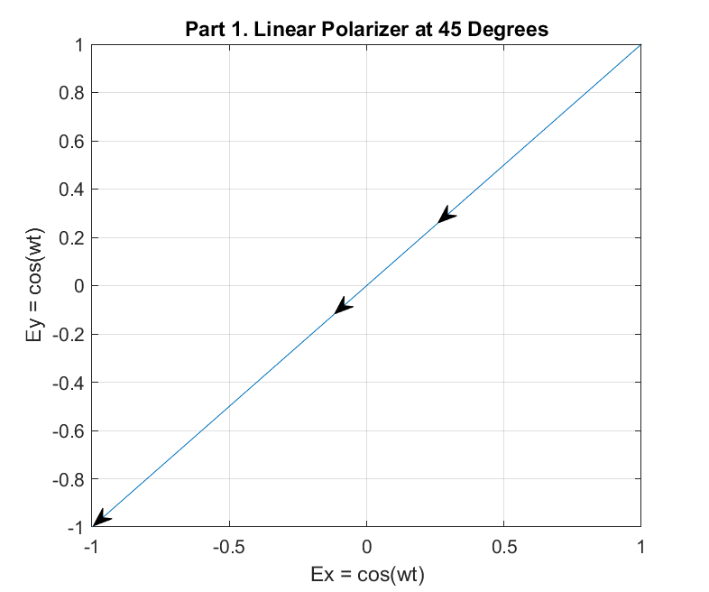
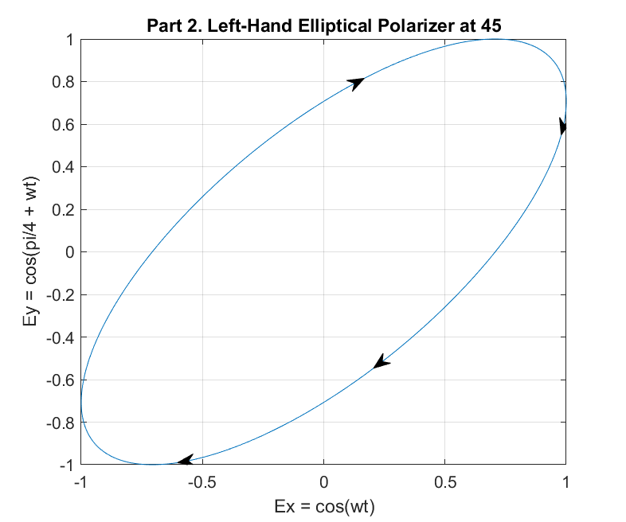
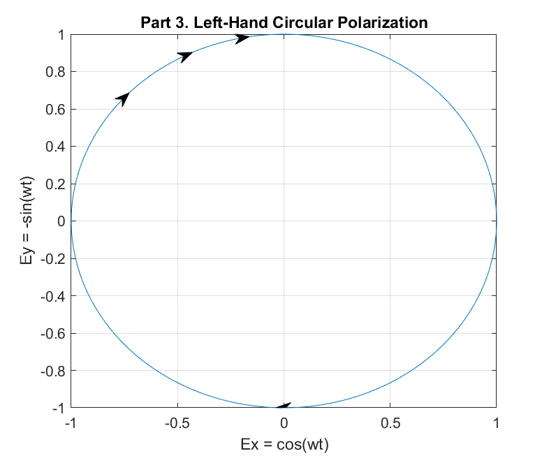
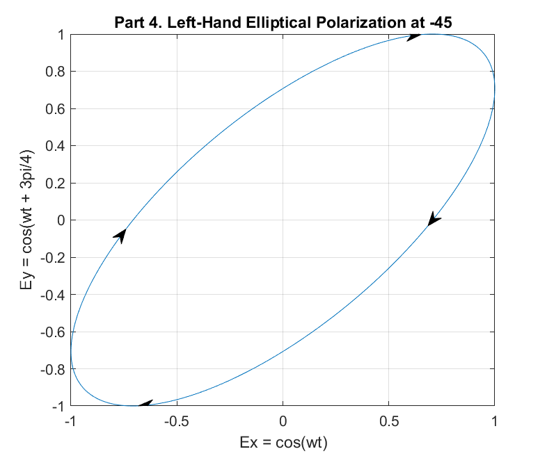
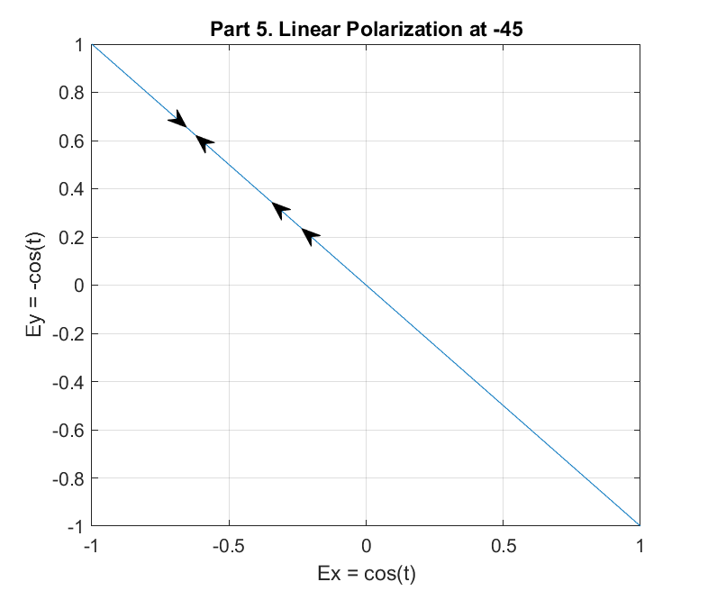
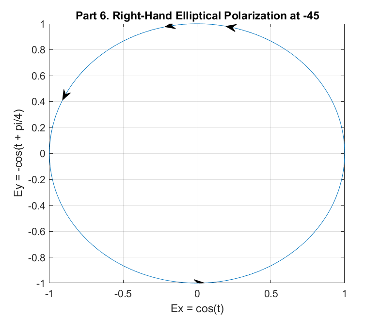
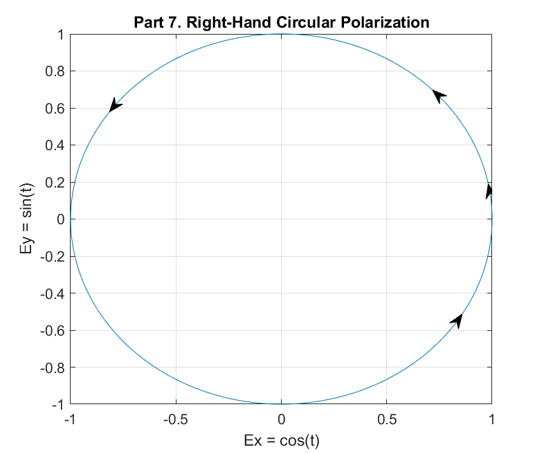
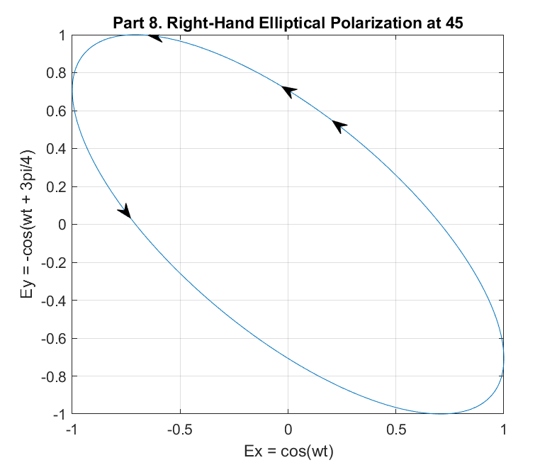
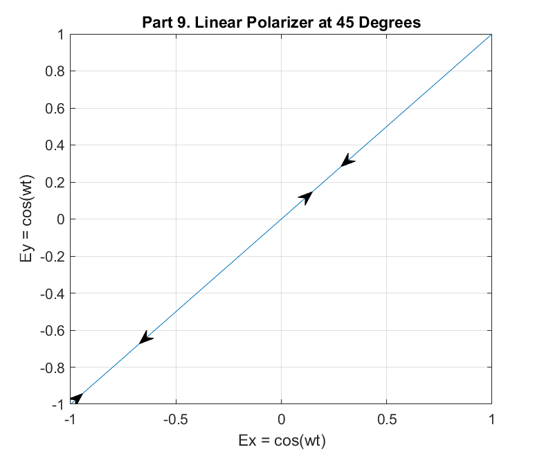

# Test 02: Light Polarization, Draft I

Elijah T. Rose (elirose)

March 11, 2020

Unfortunately, I was not able to internalize polarities and these problems within 2 days. I will continue working on it and attempt to turn in another revision after spring break -- afterall, this is a learning assessment, not a punitive one.

## Function File
```matlab
function GraphPolarizer(xFun, yFun, varargin)
    t = 0:0.01:50;
    x=xFun(t);
    y=yFun(t);
    plot(x,y)
    
    
    %% Arrow Annotation
    % Dynamically generates directional arrows around the curve.    
    for i = 0:0
        %Pt1 = randi(length(t)-1);
        Pt1 = round(length(t)/8);
        if (Pt1 == 0) 
            Pt = Pt + 1;
        end
        Pt2 = Pt1 + 1;
        Pa = [x(Pt1) y(Pt1)]; 
        Pb = [x(Pt2) y(Pt2)];
        Vba = Pb - Pa;
        a = annotation('arrow', [0 0], [0 0]);
        set(a, 'parent', gca);
        set(a, 'position', [Pa(1) Pa(2) Vba(1) Vba(2)])
    end

    %% Labels Galore
    % Labelling things using the variables.
    grid
    narg = length(varargin);
    title("Part 1");
    xlabel("Ex = "+func2str(xFun)+"(wt)");
    ylabel("Ey = "+func2str(yFun)+"(wt)");
    switch narg
        case 1
            title("Part " + varargin(1));
        case 2
            title("Part " + varargin(1));
            xlabel("Ex = "+ varargin(2));
        case 3
            title("Part " + varargin(1));
            xlabel("Ex = "+ varargin(2));
            ylabel("Ey = "+ varargin(3));
    end
    
    %% Saving
    persistent callCount
    if isempty(callCount)
        callCount = 0;
    end
    callCount = callCount + 1;
    
    saveas(gcf, "Part_" + int2str(callCount) + ".png");
end

%% Mistakes
    % And this is why I bloody HATE MatLab. Look at this absolute
    % NIGHTMARE to get an frickin arrow to show up because lord forbid
    % they allow annotation to accept real coordinates or quiver to have
    % adjustable graphics. Good grief. Thanks to marsei 
    % https://stackoverflow.com/questions/18776172/...
    % in-matlab-how-do-i-change-the-arrow-head-style-in-quiver-plot
    % for this unholy abdomination of a workaround.

%     xmin = min(x)
%     xmax = max(x)
%     xrange = xmax - xmin
%     ymin = min(y)
%     ymax = max(y)
%     yrange = ymax - ymin
%     Pan = [(Pa(1)-xmin)/xrange (Pa(2)-ymin)/yrange]
%     Pbn = [(Pb(1)-xmin)/xrange (Pb(2)-ymin)/yrange]
%     quiver(Pa(1), Pa(2), Vba(1), Vba(2), 0, 'MaxHeadSize',50);
%     ah = annotation('arrow','headStyle','cback1','HeadLength',...
%          headLength,'HeadWidth',headWidth);
%     set(ah,'parent',gca);
```

## Running File
```matlab
clear
clc

GraphPolarizer(@cos,@cos,"1. Linear Polarizer at 45 Degrees");


GraphPolarizer(@cos,@cosQuarter, "2. Left-Hand Elliptical Polarizer at 45",...
    "cos(wt)", "cos(pi/4 + wt)");

GraphPolarizer(@cos,@nSin, "3. Left-Hand Circular Polarization",...
    "cos(wt)", "-sin(wt)");


GraphPolarizer(@cos,@cosTripleQuarter, "4. Left-Hand Elliptical Polarization at -45",...
    "cos(wt)", "cos(wt + 3pi/4)");

% Q: Why do we use wt above, thent here?
GraphPolarizer(@cos,@nCos, "5. Linear Polarization at -45",...
    "cos(t)", "-cos(t)");

GraphPolarizer(@cos,@nCosQuarter, "6. Right-Hand Elliptical Polarization at -45",...
    "cos(t)", "-cos(t + pi/4)");


GraphPolarizer(@cos,@sin, "7. Right-Hand Circular Polarization",...
    "cos(t)", "sin(t)");

GraphPolarizer(@cos,@nCosTripleQuarter, "8. Right-Hand Elliptical Polarization at 45",...
    "cos(wt)", "-cos(wt + 3pi/4)");

GraphPolarizer(@cos,@cos,"9. Linear Polarizer at 45 Degrees");

function result = cosQuarter(t)
     result = cos(t + pi/4);
end

function result = nSin(t)
    result = -sin(t);
end

function result = cosTripleQuarter(t)
     result = cos(t + pi/4);
end

function result = nCos(t)
    result = -cos(t);
end

function result = nCosQuarter(t)
     result = -cosQuarter(t + pi/4);
end

function result = nCosTripleQuarter(t)
     result = -cosTripleQuarter(t);
end
```









