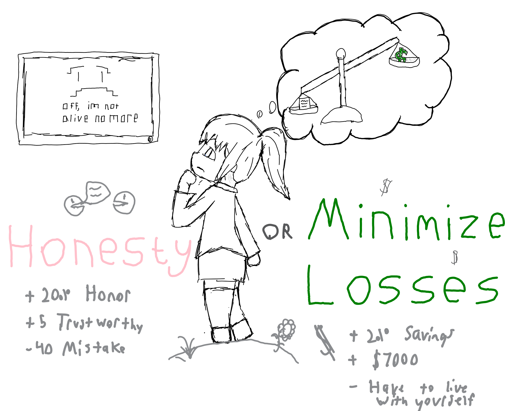

<style>
.container{
    display: flex;
}
.col{
    flex: 1;
}
img {
    width = 50%;
}
</style>

## EE341 - Polarization of Light
- Elijah T. Rose (elirose)
- Date: 4.22.2020

> "Engineer at your service." - Engineer, [Stronghold Game Series](https://en.wikipedia.org/wiki/Stronghold_(2001_video_game))

note: Hello

---

## Overview
1. Polarization of Light
2. ~~Jones Matrices~~
3. Ethics Case

---

## I. Polarization of Light
Light propagates in strange ways, not just along its movement...

----

### Graphing Code

```matlab
function GraphPolarizer(xFun, yFun, varargin)
    t = 0:0.01:50;
    x=xFun(t);
    y=yFun(t);
    plot(x,y)
    
    
    %% Arrow Annotation
    % Dynamically generates directional arrows around the curve.    
    for i = 0:0
        %Pt1 = randi(length(t)-1);
        Pt1 = round(length(t)/8);
        if (Pt1 == 0) 
            Pt = Pt + 1;
        end
        Pt2 = Pt1 + 1;
        Pa = [x(Pt1) y(Pt1)]; 
        Pb = [x(Pt2) y(Pt2)];
        Vba = Pb - Pa;
        a = annotation('arrow', [0 0], [0 0]);
        set(a, 'parent', gca);
        set(a, 'position', [Pa(1) Pa(2) Vba(1) Vba(2)])
    end

    %% Labels Galore
    % Labelling things using the variables.
    grid
    narg = length(varargin);
    title("Part 1");
    xlabel("Ex = "+func2str(xFun)+"(wt)");
    ylabel("Ey = "+func2str(yFun)+"(wt)");
    switch narg
        case 1
            title("Part " + varargin(1));
        case 2
            title("Part " + varargin(1));
            xlabel("Ex = "+ varargin(2));
        case 3
            title("Part " + varargin(1));
            xlabel("Ex = "+ varargin(2));
            ylabel("Ey = "+ varargin(3));
    end
    
    %% Saving
    persistent callCount
    if isempty(callCount)
        callCount = 0;
    end
    callCount = callCount + 1;
    
    saveas(gcf, "Part_" + int2str(callCount) + ".png");
end
```

----

### 1. Linear Polarizer

```matlab
GraphPolarizer(@cos,@cos,"1. Linear Polarizer at 45 Degrees");
```


----

### 2. Linear Polarizer

```matlab
GraphPolarizer(@cos,@cosQuarter, "2. Left-Hand Elliptical Polarizer at 45",...
    "cos(wt)", "cos(pi/4 + wt)");
```


----

### 3. Left-Hand Circular Polarization

```matlab
GraphPolarizer(@cos,@nSin, "3. Left-Hand Circular Polarization",...
    "cos(wt)", "-sin(wt)");
```


----

### 4. Left-Hand Elliptical Polarization at -45

```matlab
GraphPolarizer(@cos,@cosTripleQuarter, "4. Left-Hand Elliptical Polarization at -45",...
    "cos(wt)", "cos(wt + 3pi/4)");
```


----

### 5. Linear Polarization at -45

```matlab
GraphPolarizer(@cos,@nCos, "5. Linear Polarization at -45",...
    "cos(t)", "-cos(t)");
```


----

### 6. Right-Hand Elliptical Polarization at -45

```matlab
GraphPolarizer(@cos,@nCosQuarter, "6. Right-Hand Elliptical Polarization at -45",...
    "cos(t)", "-cos(t + pi/4)");
```


----

### 7. Right-Hand Circular Polarization

```matlab
GraphPolarizer(@cos,@sin, "7. Right-Hand Circular Polarization",...
    "cos(t)", "sin(t)");
```


----

### 8. Right-Hand Elliptical Polarization at 45

```matlab
GraphPolarizer(@cos,@nCosTripleQuarter, "8. Right-Hand Elliptical Polarization at 45",...
    "cos(wt)", "-cos(wt + 3pi/4)");
```


----

### 9. Linear Polarizer at 45 Degrees

```matlab
GraphPolarizer(@cos,@cos,"9. Linear Polarizer at 45 Degrees");
```


---


## II. Ethics Case Study 


> "And now for something completely different!" - [And Now for Something Completely Different](https://en.wikipedia.org/wiki/And_Now_for_Something_Completely_Different)

----


### Catherine's Dilemma 

<div class="container">

<div class="col">

#### Be Honest
Tell the customer that the mistake was on her own company and the units can be replaced for free.
</div>

<div class="col">

#### Lie
Report the units as incorrectly installed or such to warrant a full re-purchase.
</div>

</div>

----


### Catherine's Dilemma



----

### Tough Moral Dilemma?
From the IEEE Code of Ethics...

----

#### Avoid Conflict of Interests
> 2. to avoid real or perceived conflicts of interest whenever possible, and to disclose them to affected parties when they do exist

----

#### Correct Errors
> 7. to seek, accept, and offer honest criticism of technical work, **to acknowledge and correct errors**, and to credit properly the contributions of others

----

#### Avoid Injuries
> 9. to avoid injuring others, their property, reputation, or employment by false or malicious action

----

### It's not a Trolley Problem


Credit: https://gavinortlund.files.wordpress.com/2013/09/fork-in-the-road.jpg

note: fairly evident, by most ethical standards you'd tell the party the units were defective. The only counter-arguement -- loyalty to the company -- (A) does not supercede ethically correct behavior, nor does blaming loyalty to a party forfeit your responsibility, (B) under ideal circumstances not be in conflict with the customer interest, as a manager should reward employees for maintaining good relations not saving the bottom dime.

---


## Conclusion
* Light rays propagate in unique ways; we can visualize this with graphs of their movement paths.
* We must strive to abide by standards of ethics for fair play as engineers.

Any Questions?

---


## Credit
...where credit's due.

* NowForSomethingCompletelyDifferent: https://en.wikipedia.org/wiki/And_Now_for_Something_Completely_Different
* Stronghold: https://en.wikipedia.org/wiki/Stronghold_(2001_video_game)
* TwoRoadsDiverged: https://gavinortlund.files.wordpress.com/2013/09/fork-in-the-road.jpg
* PolarizationOfLight: https://www.physicsclassroom.com/class/light/Lesson-1/Polarization
* EthicalCaseStudy: https://www.scu.edu/ethics/focus-areas/more/engineering-ethics/engineering-ethics-cases/may-the-truth-be-with-you/


