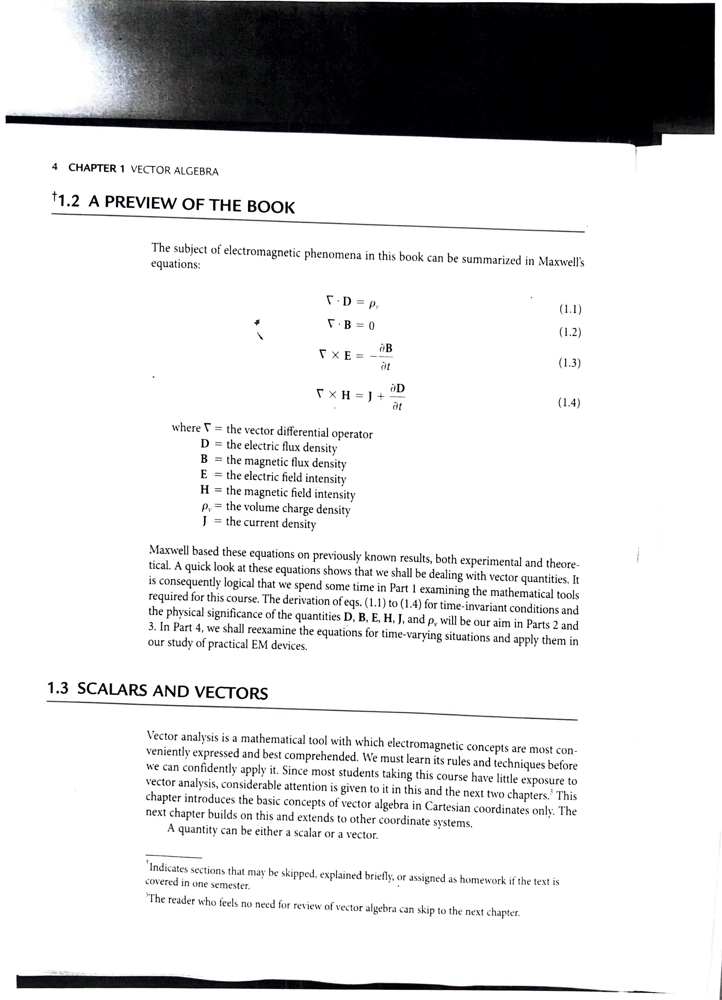
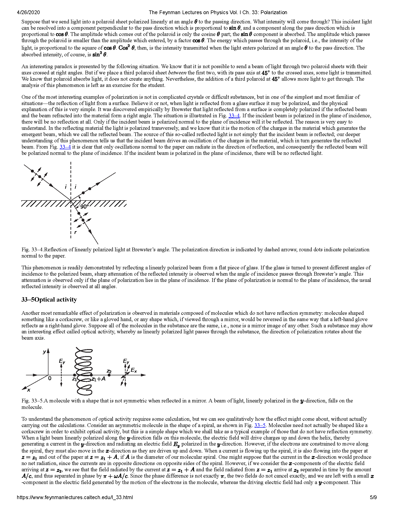
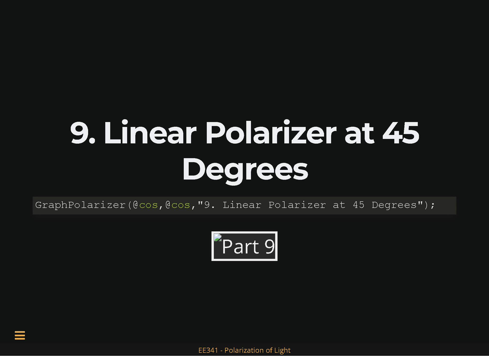
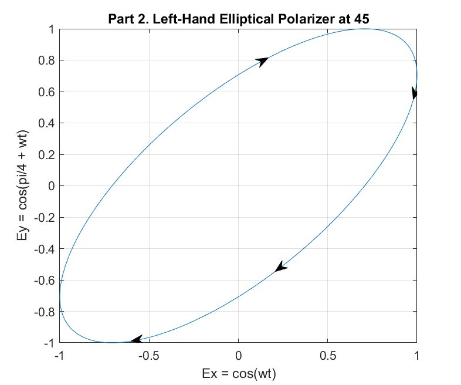
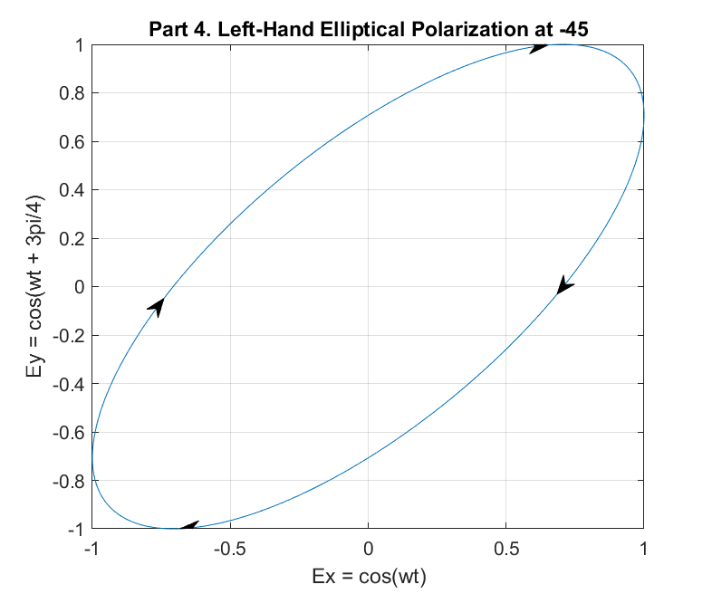
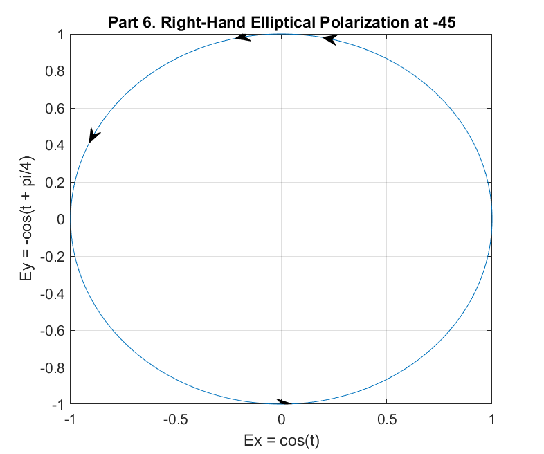
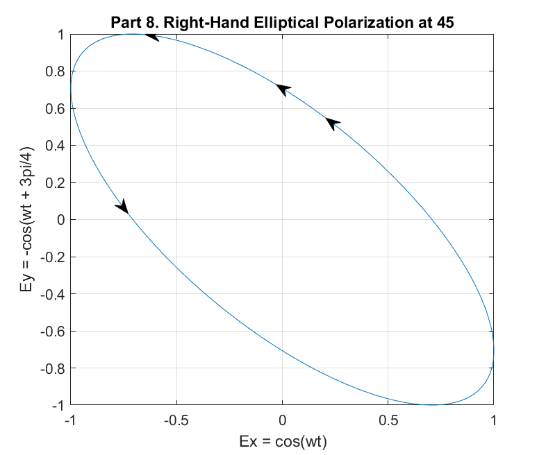

# Assignments

## Course-Specific Documents
These documents are only applicable to this course and do not have inherent educational value. They are included at the request of the instructor.

### Syllabus


### Calendar


### Group Project


## Educational Documents

### Vector Derivatives


### Maxwell's Equations
Page 4 from Textbook



### Maxwell's Equations Final
Page 414 from Textbook


### Scientific Method


### Critical Thinking
Full Source: https://images.pearsonassessments.com/images/tmrs/CriticalThinkingReviewFINAL.pdf


### IEEE Code of Ethics
Full Source: https://www.ieee.org/about/corporate/governance/p7-8.html 

> We, the members of the IEEE, in recognition of the importance of our technologies in affecting the quality of life throughout the world, and in accepting a personal obligation to our profession, its members, and the communities we serve, do hereby commit ourselves to the highest ethical and professional conduct and agree:

1. to hold paramount the safety, health, and welfare of the public, to strive to comply with ethical design and sustainable development practices, and to disclose promptly factors that might endanger the public or the environment;

2. to avoid real or perceived conflicts of interest whenever possible, and to disclose them to affected parties when they do exist;

3. to be honest and realistic in stating claims or estimates based on available data;  

4. to reject bribery in all its forms;  

5. to improve the understanding by individuals and society of the capabilities and societal implications of conventional and emerging technologies, including intelligent systems; 

6. to maintain and improve our technical competence and to undertake technological tasks for others only if qualified by training or experience, or after full disclosure of pertinent limitations;  

7. to seek, accept, and offer honest criticism of technical work, to acknowledge and correct errors, and to credit properly the contributions of others;  

8. to treat fairly all persons and to not engage in acts of discrimination based on race, religion, gender, disability, age, national origin, sexual orientation, gender identity, or gender expression;

9. to avoid injuring others, their property, reputation, or employment by false or malicious action;

10. to assist colleagues and co-workers in their professional development and to support them in following this code of ethics.

### Going Polarized

https://thinklucid.com/polarization-white-paper/ 


### Polarization

https://www.feynmanlectures.caltech.edu/I_33.html





### Jones Matrices

https://en.wikipedia.org/wiki/Jones_calculus


### Linear vs Direct Proportionality

https://www.mytutor.co.uk/answers/17552/A-Level/Physics/What-is-the-difference-between-linearly-directly-and-inversely-proportional-relationships/


\clearpage

### Bertrand Russell's Essential Rules of Critical Thinking

https://www.teachthought.com/critical-thinking/bertrand-russells-10-rules-of-critical-thinking/ 
http://www.criticalthinking.org/pages/college-and-university-students/799 <-- Not the link, but included on the page

1. Do not feel absolutely certain of anything.
2. Do not think it worth while to proceed by concealing evidence, for the evidence is sure to come to light.
3. Never try to discourage thinking for you are sure to succeed.
4. When you meet with opposition, even if it should be from your husband or your children, endeavor to overcome it by argument and not by authority, for a victory dependent upon authority is unreal and illusory.
5. Have no respect for the authority of others, for there are always contrary authorities to be found.
6. Do not use power to suppress opinions you think pernicious, for if you do the opinions will suppress you.
7. Do not fear to be eccentric in opinion, for every opinion now accepted was once eccentric.
8. Find more pleasure in intelligent dissent than in passive agreement, for, if you value intelligence as you should, the former implies a deeper agreement than the latter.
9. Be scrupulously truthful, even if the truth is inconvenient, for it is more inconvenient when you try to conceal it.
10. Do not feel envious of the happiness of those who live in a fool’s paradise, for only a fool will think that it is happiness.

\newpage

* Not Included
  * Scan of Pg. 314 and 315 of the Book
  * Group Project Assignment

## Reflections

### Critical Thinking
> The objective analysis and evaluation of an issue in order to form a judgment.

There's not much more to it. Simply, it is knowing how to use information to connect and form relationships in order to deduce further information. It does *not* relate to being able to store or know a lot of things, but rather knowing how to obtain more information and apply it, an important distinction. While it often behooves someone to be both knowledgeable and a critical thinker, i.e. how to apply said knowledge, these two do not necessarily follow. As such, it is more important to learn critical thinking and the methods in which one solves problems over memorizing rote cases due to the ever-changing knowledge-scape.

Relevant Video (funny, but has some curses/inappropriate humor): https://youtu.be/qMrnVkDH2Ak

\newpage

### Deductive Reasoning: Certain Logic with Uncertain Results
Deductive reasoning stands as a very useful daily tool and even when not applied explicitly is used in daily presumptions (not assumptions) and decision-making processes. Deductive reasoning uses general, "known" premises presumed true to create a logical conclusion. A simple example: "Greens and salads are healthy, so the salad from this store is healthy." That can be further extended with "Greasy meats are not healthy, ergo the hamburger from this store is not healthy." Which when combined can allow more effective decision-making rather than blind-guessing (note that the decision-making part and choosing the salad over the hamburger is NOT deductive reasoning here, the underlying conclusions are).

Deduction is important in everyday-life as well as scientific and mathematical thinking. However, it is not infallible, and must be used cautiously, as it is only as strong as its underlying premises. For instance, green food and salads are NOT inherently always 100% healthy -- a moldy green meat covered in poisoned tomatoes would be a counter-argument. It is more dangerous when applied to larger biases, such as those that we make of genders and races or the like as it is dificult to separate facts mixed with exceptions and stereotypes/opinions. A healthy *skepticism* is needed in applying deduction, allowing you to presume a general conclusion but also allow for exceptions and counters to the premises of your conclusion.

The problem is not deductive reasoning itself, as logically if the premises hold true then the conclusions hold true, and deductive reasoning is about as certain as you can obtain knowledge in logical thinking (assuming, of course, our concepts of logical processes hold true and we do not delve into deeper and more abstract epistemological issue). It's how we generate premises, via inductive reasoning. You may think salads are healthy as eating them has made you feel good, kept you alive, is said to be good from various sources, etc. Each source of knowledge that you used to generate your premise that "salads are healthy" could be wrong, or the issue could be more nuanced than the premise suggests (i.e. "Vitamin X typically found in X food typically found in salads, when prepared correctly as it typically is in most human establishments, shows to generally help humans in growth/survival").

We almost *must* make assumptions at some level in order to function with any semblance of what we currently call living, and even our axioms of "a is a" and underlying faith in logical/mathematical/scientific thinking are at their core blind, dogmatic, and "self-serving" beliefs. You'd likely be correct in assuming the sun will rise tomorrow based on your past experience and sources supporting the premise that "the sun rises each morning" and applying it using deduction such that "tomorrow morning is a morning, the sun rises each morning, thus the sun will rise tomorrow morning", even if the actuality is more nuanced ("the sun does not rise, but rather appears to rise based on our changing position relative to the sun") or entirely false ("a fast massive object snuffed the sun out a few minutes ago or stopped earth's orbit thus the premise that the sun will rise each morning is false based on the current definitions of 'morning' and such"). Yet we also arguably should hold a healthy skepticism for our premises -- treat your conclusions and premises alike as a probability, not a certainty, as deductive reasoning only implies certainty if the premise is certain.

\newpage

### Critical vs. Deductive Reasoning
Apparently there was some confusion on critical thinking and how it relates to deductive reasoning. As such, I will summarize the two and expound on their differences.

#### Critical Thinking

Critical thinking largely relates to the ability to think "outside the box", as they say. It is the *application* of knowledge and relationships in order to form new relationships. It does *not* apply to the retention of knowledge, nor even necessarily logical thought processes. Critical thinking is a creative endeavor to grasp for new ideas and meaning than is readily apparent.

#### Deductive Reasoning

Deductive reasoning is the seeking of individual truths and knowledge from general premises. It is a very strong manner of obtaining conclusions in logic, though it is as weak as each of its premises. A common example of deductive reasoning: "Hamburgers are unhealthy. McDouble is a hamburger. McDoubles are thus unhealthy."

Deductive reasoning stands in contrast with and relies on *inductive reasoning*, the seeking of a general truth from specific instances. We think hamburgers are unhealthy or that animals must drink water or the sun will rise each day due to a mixture of inductive and deductive reasoning. First, as children, we saw that everyone drunk water and the sun rose each day, thus we made an inference that these were general truths. Then, mostly subconsciously, we applied these "truths" to predictions in the future: animals for the most part will still need to drink water and tomorrow, as it is a day and all days before have had suns, will follow that trend. 

Deduction is thusly fallible, however, in that those trends may not be true: A company could form a Health-burger, animals could evolve to accept H_2 O_2 instead of water, and the sun one day may fade. The only other major premises we have are axioms -- "inherent" truths that we establish as the groundwork for our beliefs and faith in some principle. Some, for instance, establish the existence of God as an inherent truth from which other truths may be deduced; more commonly and socially acceptable, many also hold various mathematic and logical principles as "truth", such as "A is equal to A" or such. These allow us to use deductive thinking outside of what we see, observe, and induce.

#### Critical Thinking in contrast to Deductive Reasoning

They are hardly alike.

When speaking about deductive reasoning, it is largely in contrast with inductive reasoning. This is because these are moreover lines of thought and step-by-step processes at obtaining new knowledge. They do not necessarily require critical thinking, even. Critical thinking refers to the ability to look at several relationships and pieces of knowledge and presume or glean new insights (and potentially wrong ones at that) from them. It is possible that perhaps "under the hood" in the brain it is a result of several subconscious, simultaneous lines of reasoning. These two concepts, however, are not fundamentally linked: deductive reasoning is a way to gain relatively sure knowledge based on premises, critical thinking is a manner of examining and extrapolating various relationships into a new potential idea.

\newpage

### Reflection on IEEE Code of Ethics
IEEE's Code of Ethics acts as a semi-abstract list of guidelines for members to follow in their actions representing IEEE. They seek to define how to act and how to not act with respect to data, individuals, and conflicts. It is also notable that they use precisely the words "ethical and professional conduct" -- they do not attempt to assign some moral value of right/wrongness to their code, only that it is the expected behaviorisms of its member, an important distinction. While IEEE's Code of Ethics is largely in-line with modern-day trends/beliefs and as such does not provide too much in the way of moral/ethical conflicts, it is important yet still for an organization to remove moral assignments, as shown here.

#### Teaching and Discussion Paves the Path to Understanding and Acceptance

> 5. to improve the understanding by individuals and society of the capabilities and societal implications of conventional and emerging technologies, including intelligent systems; 

Professor Myers and myself have spent many hours debating the pros and cons of upcoming trends in technology, such as the prevalence of cameras, use of Big Data to target advertisements, GMOs, etc. While our opinions may drastically differ, we do agree unilaterally that there should be more education on these topics in school systems and to the public. It appears to us that people in general are not learning enough about the upcoming changes of organizations and the government in how they view, observe, and interact with people and how this may affect our future, and without the education on these matters, it is dificult for people to make informed, free-thinking, and thought-out decisions outside of what some single person or article told them to think.

As such, we support this guideline full-heartedly, and it is on our roadmap in our newly begun organization S.E.E.D. to put educate people on new technologies and how it may affect their lives as well as spark dialogue on the matter within the campus.

#### Know your Limits

> 6. to maintain and improve our technical competence and to undertake technological tasks for others only if qualified by training or experience, or after full disclosure of pertinent limitations;  

I've had a saying that goes like...

> The only thing more dangerous than someone who knows nothing is someone who knows everything.

It's probably on the internet somewhere, and mostly just a rewording of the innumerable anecdotes of the dangers of pretending to know what one does not. However, I use it as a personal guideline -- never let my eagerness to do or overconfidence deceive others and, more importantly, myself. I know some disagree, and I have been told by many that instead you should "fake it till you make it" or "always appear to know what you're doing", however in my limited experiences I have found admitting short-comings and always acting below your skill-level ensures that you can deliver on promises and expectations more reliably and thus be a proficient member of your team or organization.

Now mind you, I am not saying never expand your skillset or only work comfortably in skills you already know -- you would never grow. However, there are ways to do that safely and with humility. Work in the "yellow zone", as they say, on the edge of your skillset, and do not be hesitant to mention when something is out of one's league, such as a complex simultaneous equation, high-paying but experienced engineering job, or obtaining a girlfriend. Approach problem energetically, but also with caution, and be aware of where to go for help. 

In short, this ethical statement resonates strongly with my personal code, as I have witnessed teams crumble due to the pretending of skills people do not have in order to "gain respect" or such.

\newpage

### Ethical Case Study

\newpage

### Reflection on Critical Thinking Quotes

\newpage

# Chapter Work
This section seeks to overview and demonstrate example problems within the text. Note that these summaries are *non-comprehensive* -- viewers will *not* be able to read this from no background and understand the topics by the end. That is the job of lectures and textbooks, whereas instead this section is dedicated to a cursory overview of the most important and practical components of the course and showing their use in problem-solving.

## Chapter-01: Vector Algebra
Vector Algebra
### Notes-01
* **Electromagnetics (EM)** is a branch of physics or electrical engineering in which electric and magnetic phenomena are studied.

#### Maxwell Equations
$$\nabla \cdot \bm{D} = \rho_v$$
$$\nabla \cdot \bm{B} = 0$$
$$\nabla \times \bm{E} = - \frac{\partial \bm{B}}{\partial t}$$
$$\nabla \times \bm{H} = \bm{J} + \frac{\partial \bm{D}}{\partial t}$$

| Symbol   | Name                               | Units | Description |
| -------- | ---------------------------------- | ----- | ----------- |
| $\nabla$ | Del - Vector Differential Operator |       |             |
| $\bm{D}$ | Electric Flux Density              |       |             |
| $\bm{B}$ | Magnetic Flux Density              |       |             |
| $\bm{E}$ | Electric Field Intensity           |       |             |
| $\bm{H}$ | Magnetic Field Intensity           |       |             |
| $\rho_v$ | Volume Charge Density              |       |             |
| $\bm{J}$ | Current Density                    |       |             |

#### Scalars versus Vectors
* **Scalars** are quantities with only magnitude.
  * E.G. $1$, $47 Joules$, $-28 kW$, etc.
* **Vectors** have both a quantity and magnitude.
  * NOTE: this is a very rudimentary and not entirely true definition; vectors are much more complex elements that extend beyond this. However, this is perhaps a more fitting definition of *Euclidean Vectors*, and will suffice for this course.
  * Technically, vectors should be bolded as $\bm{A}$, however even the book cheats often and uses a regular $A$ as it becomes tedious to write `$\bm{A}$` in every case.
* Scalars are multiplied in the typical manner: $2 \times 7 = 14$
* Vectors can be multiplied in two primary ways (we are assuming a 3-dimensional space, though with true vectors these definitions extend past):
  * **Dot Product**: represented as $\bm{A} \cdot \bm{B} = C$, produces a scalar output. As such, also called a *scalar product*.
    $$\bm{A} \cdot \bm{B} = A_xB_x + A_yB_y + A_zB_z$$
  * **Cross Product**: represented as $\bm{A} \times \bm{B} = \bm{C}$, produces a vector output orthogonal in direction to both $\bm{A}$ and $\bm{B}$. As such, also called a *vector product*.
    $$\bm{A} \cdot \bm{B} = 
    \det{\begin{vmatrix}
    \bm{a}_x & \bm{a}_y & \bm{a}_z \\
    A_x & A_y & A_z \\
    B_x & B_y & B_z \\
    \end{vmatrix}}
    = (A_yB_z - A_zB_y)\bm{a_x} + (A_zB_x - A_xB_z)\bm{a_y} + (A_xB_y - A_yB_x)\bm{a_z}$$
* Magnitude of vectors - 
* Addition/Subtraction of Vectors
* Unit Vectors
* Determinant: $\det{\begin{vmatrix}\bm{A} \times \bm{B}\end{vmatrix}}$
* Representation
  * Bracket Form: 
  * Unit Vector Form:
  * "Physics" Form: 
* Law of Sines
* Law of Cosines
* Component along Vector
* Projection along Vector

### Problems-01
#### Problem-1.1
Find the unit vector along the line joining point $(2, 4, 4)$ to point $(-3, 2, 2)$.

A classic displacement problem, it can be solved with a simple formula: $\frac{A - B}{|A - B|}$

1. Find the difference between $A$ and $B$:
   
    $A-B = \langle 2, 4, 4 \rangle - \langle -3, 2, 2 \rangle = \langle (2) - (-3), (4) - (2), (4) - (2)\rangle = \langle 5, 2, 2 \rangle$

    This indicates that the displacement vector between $A$ and $B$ is $\langle 5, 2, 2 \rangle$.
2. Find the magnitude of $\langle 5, 2, 2 \rangle$.
   
    $|\langle 5, 2, 2 \rangle| = \sqrt{5^2 + 2^2 + 2^2} = \sqrt{33}$

3. Divide by the vector by the magnitude:
    $\frac{\langle 5, 2, 2 \rangle}{\sqrt{33}} = \langle \frac{5}{\sqrt{33}}, \frac{2}{\sqrt{33}}, \frac{2}{\sqrt{33}} \rangle$

This vector represents the displacement vector as a unit vector, I.E. its magnitude is $1$ and can be easily multiplied to obtain any vector of magnitude $x$ in its direction by the simple product of $x\hat{C}$ ($\hat{C}$ being said Unit Vector).

#### Problem-1.3
Given vectors $\bm{A} = 2\bm{a}_x + 5\bm{a}_z$ and $\bm{B} = \bm{a}_x - 3\bm{a}_y + 4\bm{a}_z$, find $\det{\begin{vmatrix}\bm{A} \times \bm{B}\end{vmatrix}} + \bm{A} \cdot \bm{B}$.

The Order of Operation rules apply, thus solve the two multiplications separately. A relatively straightforward problem, just solve it in pieces:

$A \times B = \langle2,0,5\rangle \times \langle 1,-3,4 \rangle = \langle [(0 \cdot 4) - (-3 \cdot 5)], -[(2 \cdot 4)-(1 \cdot 5)],[(2 \cdot -3)-(1 \cdot 0)] = \langle0+15,-8+5,-6-0\rangle = \langle15,-3,-6\rangle$

$|A \times B| = |\langle15,-3,-6\rangle| = \sqrt{15^2 + (-3)^2 + (-6)^2} = \sqrt{270} = \sqrt{2*5*3*9} = 3\sqrt{30}$

$A \cdot B = \langle2,0,5\rangle \cdot \langle1,-3,4\rangle = (2 \cdot 1) + (0 \cdot -3) + (5 \cdot 4) = (2) + (0) + (20) = 22$

$\det{\begin{vmatrix}\bm{A} \times \bm{B}\end{vmatrix}} + \bm{A} \cdot \bm{B} = 3 \sqrt{30} + 22 \approx 38.43$

#### Problem-1.11
If $\bm{A} = 4\bm{a}_x - 6\bm{a}_y + \bm{a}_z$ and $\bm{B} = 2\bm{a}_x + 5\bm{a}_z$, find:
##### (a) $A \cdot B + 2 |B|^2$
Separate the part and solve independently:

$A \cdot B = \langle4,-6,1\rangle \cdot \langle2,0,5\rangle = (4\cdot2)+(-6 \cdot 0) + (1 \cdot 5) =13$

$2|B|^2 = 2\sqrt{2^2 + 5^2}^2 = 2 \cdot 29 = 58$

Then simply add the scalars:

$A \cdot B + 2 |B|^2 = 13 + 58 = 71$

##### (b) A unit vector perpendicular to both $A$ and $B$.
Recall that Cross Products produce a vector that is orthogonal (perpendicular) to both input vectors. Thus, a simple way to find a vector perpendicular to $A$ and $B$ is to take their cross product, then divide by their magnitude to obtain a unit vector in that direction. 

First find the Cross Product, representing the vector orthogonal to both $A$ and $B$...

$A \times B = C = \langle4,-6,1\rangle \times \langle2,0,5\rangle = \langle(-6 \cdot 5)-(0 \cdot 1),-(4 \cdot 5)+(2 \cdot 1),(4 \cdot 0)-(-6 \cdot 2)\rangle = \langle-30,-18,-12\rangle$

Next, find the magnitude of that vector...

$|C| = |\langle-30,-18,-12\rangle| = \sqrt{30^2 + 18^2 + 12^2} = \sqrt{1368} = 6\sqrt{38} \approx 36.99$

Finally, divide $C$ by its magnitude to obtain a unit vector with its direction:

$\frac{C}{|C|} = \frac{\langle-30,-18,-12\rangle}{6\sqrt{38}} = \langle \frac{-5}{\sqrt{38}},\frac{-3}{\sqrt{38}},\frac{-2}{\sqrt{38}}\rangle$

This unit vector is orthogonal to both $A$ and $B$. Huzzah.

#### Problem-1.23
Let  $A = -3a_x + a_y + 2a_z$, $B = 2a_x -5a_y + a_z$, $C = a_y + 4a_z$. Determine:
##### (a) The minimum angle between $A$ and $B$.
A simple way to find an angle is to use the Dot Product formula:

$$\bm{A} \cdot \bm{B} = AB\cos{\theta_{AB}}$$
$$\cos{\theta_{AB}} = \frac{\bm{A} \cdot \bm{B}}{AB}$$
$$\theta_{AB} = \arccos{\frac{\bm{A} \cdot \bm{B}}{AB}}$$

Applying this to our problem...
$$\theta_{AB} = \arccos{\frac{\langle-3,1,2\rangle \cdot \langle2,-5,1\rangle}{\sqrt{14} \cdot \sqrt{30}}} = arccos{\frac{-6-5+2}{2\sqrt{105}}} \approx \arccos{-\frac{9}{20.49}} \approx 63.95 \si{\degree}$$

Note that it specifies *minimal* angle, as technically another angle between $A$ and $B$ is $296.05 \si{\degree}$ (if one was to travel in the opposite direction).

##### (b) The component of $A$ along $C$.
The component of $A$ along $C$ is a scalar representing how much of $A$ is "in-line" with $C$. As given in the notes, the formula to find this...


$$\textit{comp}_CA = \frac{A \cdot C}{|C|}$$
$$\frac{\langle{} \cdot C}{|C|}$$

##### (c) $D = A +2B -3C$.
##### (d) $(A \times B \cdot C)$.

\newpage

## Chapter-02: Coordinate Systems and Transformations
### Notes
### Problems

\newpage

## Chapter-03: Vector Calculus
### Notes
### Problems

\newpage

## Chapter-04: Electrostatic Fields
### Notes
### Problems

\newpage

## Chapter-05: Conductors
### Notes
### Problems

\newpage

## Chapter-09: Maxwell's Equations
### Notes
### Problems

\clearpage

# Project Work
The project mostly extends off Exam-02 and was presented via a powerpoint presentation. Said presentation is printed to PDF and included here, however note that it was done via js-. Additionally, the presentation style was largely focused on how presentations are typically done: low amounts of text, with images and graphics to help aide the presenter rather than deliver the information itself. As such, it does not demonstrate the full knowledge of the situation. Some speaker notes are added to help convey more information, though these too are non-comprehensive.

The video of the presentation, minus some sections, has been uploaded here ().

## Slideshow
Done in Reveal JS (Markdown flavored, see [Slideshow.md](Slideshow.md))





\clearpage

# Exams

## E01
Not included in this report.

\newpage

## E02
### Original MATLAB Code

# Test 02: Light Polarization, Draft I

Elijah T. Rose (elirose)

March 11, 2020

Unfortunately, I was not able to internalize polarities and these problems within 2 days. I will continue working on it and attempt to turn in another revision after spring break -- afterall, this is a learning assessment, not a punitive one.

## Function File
```matlab
function GraphPolarizer(xFun, yFun, varargin)
    t = 0:0.01:50;
    x=xFun(t);
    y=yFun(t);
    plot(x,y)
    
    
    %% Arrow Annotation
    % Dynamically generates directional arrows around the curve.    
    for i = 0:0
        %Pt1 = randi(length(t)-1);
        Pt1 = round(length(t)/8);
        if (Pt1 == 0) 
            Pt = Pt + 1;
        end
        Pt2 = Pt1 + 1;
        Pa = [x(Pt1) y(Pt1)]; 
        Pb = [x(Pt2) y(Pt2)];
        Vba = Pb - Pa;
        a = annotation('arrow', [0 0], [0 0]);
        set(a, 'parent', gca);
        set(a, 'position', [Pa(1) Pa(2) Vba(1) Vba(2)])
    end

    %% Labels Galore
    % Labelling things using the variables.
    grid
    narg = length(varargin);
    title("Part 1");
    xlabel("Ex = "+func2str(xFun)+"(wt)");
    ylabel("Ey = "+func2str(yFun)+"(wt)");
    switch narg
        case 1
            title("Part " + varargin(1));
        case 2
            title("Part " + varargin(1));
            xlabel("Ex = "+ varargin(2));
        case 3
            title("Part " + varargin(1));
            xlabel("Ex = "+ varargin(2));
            ylabel("Ey = "+ varargin(3));
    end
    
    %% Saving
    persistent callCount
    if isempty(callCount)
        callCount = 0;
    end
    callCount = callCount + 1;
    
    saveas(gcf, "Part_" + int2str(callCount) + ".png");
end

%% Mistakes
    % And this is why I bloody HATE MatLab. Look at this absolute
    % NIGHTMARE to get an frickin arrow to show up because lord forbid
    % they allow annotation to accept real coordinates or quiver to have
    % adjustable graphics. Good grief. Thanks to marsei 
    % https://stackoverflow.com/questions/18776172/...
    % in-matlab-how-do-i-change-the-arrow-head-style-in-quiver-plot
    % for this unholy abdomination of a workaround.

%     xmin = min(x)
%     xmax = max(x)
%     xrange = xmax - xmin
%     ymin = min(y)
%     ymax = max(y)
%     yrange = ymax - ymin
%     Pan = [(Pa(1)-xmin)/xrange (Pa(2)-ymin)/yrange]
%     Pbn = [(Pb(1)-xmin)/xrange (Pb(2)-ymin)/yrange]
%     quiver(Pa(1), Pa(2), Vba(1), Vba(2), 0, 'MaxHeadSize',50);
%     ah = annotation('arrow','headStyle','cback1','HeadLength',...
%          headLength,'HeadWidth',headWidth);
%     set(ah,'parent',gca);
```

## Running File
```matlab
clear
clc

GraphPolarizer(@cos,@cos,"1. Linear Polarizer at 45 Degrees");


GraphPolarizer(@cos,@cosQuarter, "2. Left-Hand Elliptical Polarizer at 45",...
    "cos(wt)", "cos(pi/4 + wt)");

GraphPolarizer(@cos,@nSin, "3. Left-Hand Circular Polarization",...
    "cos(wt)", "-sin(wt)");


GraphPolarizer(@cos,@cosTripleQuarter, "4. Left-Hand Elliptical Polarization at -45",...
    "cos(wt)", "cos(wt + 3pi/4)");

% Q: Why do we use wt above, thent here?
GraphPolarizer(@cos,@nCos, "5. Linear Polarization at -45",...
    "cos(t)", "-cos(t)");

GraphPolarizer(@cos,@nCosQuarter, "6. Right-Hand Elliptical Polarization at -45",...
    "cos(t)", "-cos(t + pi/4)");


GraphPolarizer(@cos,@sin, "7. Right-Hand Circular Polarization",...
    "cos(t)", "sin(t)");

GraphPolarizer(@cos,@nCosTripleQuarter, "8. Right-Hand Elliptical Polarization at 45",...
    "cos(wt)", "-cos(wt + 3pi/4)");

GraphPolarizer(@cos,@cos,"9. Linear Polarizer at 45 Degrees");

function result = cosQuarter(t)
     result = cos(t + pi/4);
end

function result = nSin(t)
    result = -sin(t);
end

function result = cosTripleQuarter(t)
     result = cos(t + pi/4);
end

function result = nCos(t)
    result = -cos(t);
end

function result = nCosQuarter(t)
     result = -cosQuarter(t + pi/4);
end

function result = nCosTripleQuarter(t)
     result = -cosTripleQuarter(t);
end
```











\clearpage

### Improved MATLAB Code

\clearpage

## Appendix


\newpage

## Acknowledgements